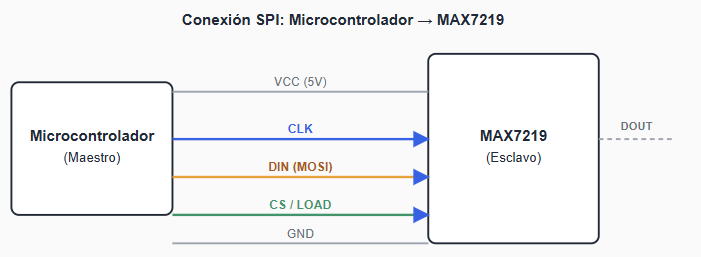
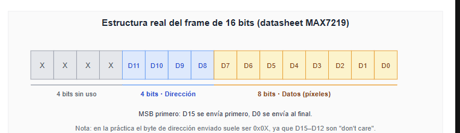
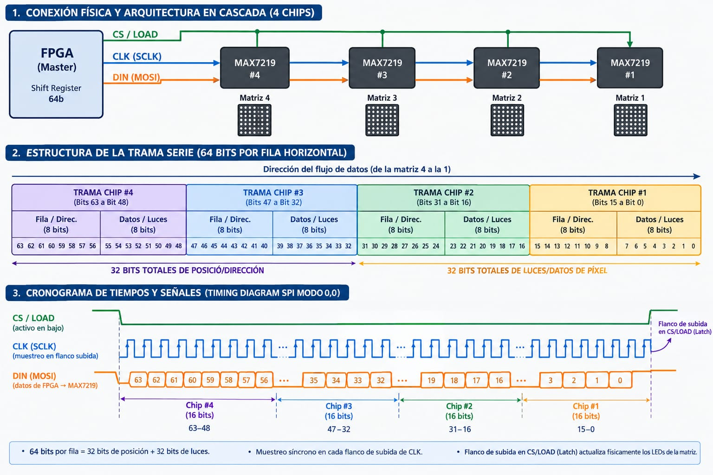
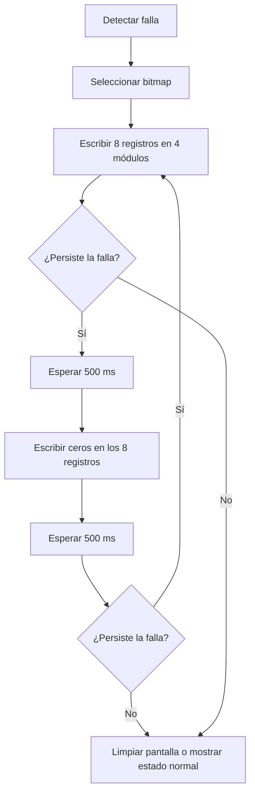

# Comunicación serie con MAX7219 para una matriz de LEDs

Este documento explica cómo enviar indicadores de falla desde un microcontrolador o FPGA a una pantalla formada por **cuatro módulos MAX7219 en cascada** (habitualmente 32 × 8 píxeles). Incluye el cableado, el formato de los comandos, la inicialización y un ejemplo de actualización y parpadeo.

> **Alcance:** el MAX7219 emplea una interfaz serie síncrona de tres señales, compatible con una configuración SPI habitual. No dispone de lectura MISO. Las posiciones visibles dependen de la orientación y el cableado del módulo; conviene comprobarlas con un patrón de prueba.

## Índice

1. [Conexión y señales](#1-conexión-y-señales)
2. [Temporización de la transferencia](#2-temporización-de-la-transferencia)
3. [Comando de 16 bits y registros](#3-comando-de-16-bits-y-registros)
4. [Cuatro módulos en cascada](#4-cuatro-módulos-en-cascada)
5. [Inicialización](#5-inicialización)
6. [Mostrar y hacer parpadear una falla](#6-mostrar-y-hacer-parpadear-una-falla)
7. [Ejemplo de implementación](#7-ejemplo-de-implementación)
8. [Comprobaciones y límites](#8-comprobaciones-y-límites)

## 1. Conexión y señales



| Señal del controlador | Pin del primer MAX7219 | Función |
| --- | --- | --- |
| `MOSI` | `DIN` | Datos de entrada, bit más significativo primero. |
| `SCK` | `CLK` | Reloj; el chip toma `DIN` en el flanco ascendente. |
| GPIO de salida | `CS` / `LOAD` | En bajo se desplazan bits; el flanco ascendente carga los registros. |
| Alimentación | `VCC`, `GND` | Alimentación y tierra común según el módulo utilizado. |

`DOUT` del primer chip se conecta a `DIN` del siguiente. `CLK` y `CS/LOAD` se distribuyen a todos los chips. No se conecta `MISO` porque el MAX7219 no devuelve datos. Comprueba los niveles lógicos admitidos por tu placa y el módulo: un controlador de 3,3 V no debe suponerse compatible con una entrada alimentada a 5 V sin revisar sus especificaciones.

## 2. Temporización de la transferencia

El cronograma se incluye en la [lámina general de la cascada](#4-cuatro-módulos-en-cascada).

1. Poner `CS/LOAD` en bajo.
2. Estabilizar cada bit en `DIN` antes del **flanco ascendente** de `CLK`; transmitir primero el bit más significativo.
3. Enviar 16 pulsos por chip (64 pulsos para cuatro chips).
4. Llevar `CS/LOAD` a alto **después de transmitir el último bit**. En ese flanco, cada chip carga su palabra de 16 bits.

**Particularidad del MAX7219:** el registro de desplazamiento toma datos con los flancos ascendentes de `CLK` incluso cuando `LOAD` está alto. `LOAD` no bloquea el reloj como un selector SPI convencional; su flanco ascendente transfiere la palabra recibida al registro indicado. Por ello, hay que completar los 64 bits de la cadena antes de cada carga y considerar este comportamiento si se comparte el bus.

Una configuración SPI habitual es **modo 0** (`CPOL=0`, `CPHA=0`), MSB primero. Ajusta frecuencia y tiempos de establecimiento, retención y pulso de `LOAD` a la hoja de datos del chip y a las condiciones de tu cableado. La figura es conceptual y no está a escala.

## 3. Comando de 16 bits y registros



| Bits | Contenido |
| --- | --- |
| `D15–D12` | Sin uso (*don't care*); normalmente se envían como `0000`. |
| `D11–D8` | Dirección de registro (4 bits). |
| `D7–D0` | Dato de 8 bits. |

Por comodidad se envían **dos bytes**: primero la dirección `0x0R`, después el dato `0xVV`. Por ejemplo, `0x01 0xA0` escribe `10100000₂` en el registro de dígito 1. Los registros 1 a 8 controlan las ocho posiciones de barrido; con `decode mode = 0`, cada bit del dato enciende o apaga un LED de esa posición. Según el módulo, esa posición puede verse como fila o columna.

| Dirección | Registro | Uso |
| --- | --- | --- |
| `0x00` | No-op | Mantiene sin cambios ese chip durante una transferencia en cascada. |
| `0x01`–`0x08` | Digit 0–7 | Ocho grupos de LEDs en modo sin decodificación. |
| `0x09` | Decode Mode | `0x00`: control directo de puntos. |
| `0x0A` | Intensity | Brillo `0x00`–`0x0F`. |
| `0x0B` | Scan Limit | `0x07`: ocho posiciones activas. |
| `0x0C` | Shutdown | `0x00`: apagado; `0x01`: funcionamiento normal. |
| `0x0F` | Display Test | `0x00`: prueba desactivada; `0x01`: todos los LED en prueba. |

## 4. Cuatro módulos en cascada



> **Cómo interpretar esta lámina:** la imagen adjunta reúne conexión, trama y temporización. Se conserva como vista general, con las siguientes correcciones técnicas que deben aplicarse al implementar el circuito:
>
> - **CLK es común a todos los chips.** Las flechas azules no representan una salida de reloj de un MAX7219 hacia otro. Solo los datos se encadenan mediante `DOUT → DIN`.
> - **Orden de envío:** en la numeración física de esta imagen, el chip #4 es el más cercano y el #1 el más alejado. Por tanto, se envía primero la palabra destinada al **#1**, luego **#2**, **#3** y finalmente **#4**. Los rótulos de destino de las tramas y del cronograma aparecen invertidos respecto a ese cableado.
> - **Dirección y datos se intercalan:** se envían cuatro parejas `[byte de dirección, byte de datos]`. No hay un bloque inicial de 32 bits de dirección seguido por 32 bits de datos, como podrían sugerir las flechas inferiores.
> - **Cada byte de dirección contiene cuatro bits sin uso y cuatro de dirección real**, detallados en la sección 3. En total hay 16 bits sin uso, 16 de dirección y 32 de datos.
> - El cronograma es conceptual: `DIN` debe estabilizarse antes de cada flanco ascendente y mantenerse el tiempo requerido después de este. Una transferencia completa contiene exactamente 64 pulsos.

La numeración #1–#4 de esta lámina es visual; el pseudocódigo utiliza índices **0–3, del más cercano al más alejado**.

Cada pulso desplaza un bit a través de los chips. Para actualizar un registro en los **cuatro módulos**, se transmiten **4 × 16 = 64 bits** con `CS/LOAD` en bajo y luego se genera **un único flanco ascendente**. La primera palabra enviada termina en el módulo **más alejado** del controlador; la última, en el más cercano.

Para dibujar una pantalla completa de 8 posiciones hacen falta **ocho transferencias de 64 bits** (512 bits), una por registro `0x01` a `0x08`. Así, los 64 bits actualizan una posición de los cuatro módulos, no toda la imagen de 32 × 8. Si solo cambia un módulo, se puede enviar `0x00 0x00` (*no-op*) a los otros tres dentro de la misma transferencia.

## 5. Inicialización

Tras encender el sistema, configura **cada chip**. Para ello, repite la misma palabra cuatro veces en cada transferencia de 64 bits:

| Orden sugerido | Dirección | Dato | Resultado |
| --- | --- | --- | --- |
| 0 | `0x0C` | `0x00` | Mantener apagada la pantalla durante la configuración. |
| 1 | `0x0F` | `0x00` | Desactivar prueba de pantalla. |
| 2 | `0x09` | `0x00` | Desactivar decodificación de caracteres. |
| 3 | `0x0B` | `0x07` | Barrer las ocho posiciones. |
| 4 | `0x0A` | `0x04` | Brillo inicial moderado; ajustar según el montaje. |
| 5 | `0x01`–`0x08` | `0x00` | Limpiar las ocho posiciones en los cuatro módulos. |
| 6 | `0x0C` | `0x01` | Salir del modo de apagado. |

## 6. Mostrar y hacer parpadear una falla

Guarda el patrón de cada indicador como ocho grupos de cuatro bytes: `bitmap[posición][módulo]`. La correspondencia entre el índice de módulo y su ubicación visible se determina en la prueba de montaje.



La limpieza requiere escribir `0x00` en **los ocho registros de cada módulo**. Subir `LOAD` no borra ni alterna por sí solo los LED. Para evitar esperas bloqueantes, un sistema que atienda otras tareas puede alternar el bitmap y la pantalla vacía con un temporizador de 500 ms.

## 7. Ejemplo de implementación

Pseudocódigo independiente del microcontrolador. `spi_write` transmite un byte completo, MSB primero; el índice 0 representa el chip más cercano al controlador.

```text
función enviar_a_todos(registro, datos[4]):
    LOAD = BAJO
    para modulo desde 3 hasta 0:       // lejano → cercano
        spi_write(registro)
        spi_write(datos[modulo])
    LOAD = ALTO

función mostrar(bitmap[8][4]):
    para posicion desde 0 hasta 7:
        enviar_a_todos(posicion + 1, bitmap[posicion])

función limpiar():
    para posicion desde 1 hasta 8:
        enviar_a_todos(posicion, [0x00, 0x00, 0x00, 0x00])

función configurar(registro, dato):
    enviar_a_todos(registro, [dato, dato, dato, dato])
```

`LOAD` debe volver a bajo antes de la siguiente llamada. Si la librería SPI controla automáticamente el pin de selección por byte, configura `LOAD` como GPIO manual para mantenerlo bajo durante los ocho bytes completos de cada transferencia.

## 8. Comprobaciones y límites

- Verifica el orden físico de los cuatro módulos con un patrón distinto en cada uno; algunos paneles integrados presentan la imagen invertida o girada.
- Confirma que `DOUT → DIN`, `CLK`, `LOAD`, alimentación y tierra estén conectados como corresponde. Los cuatro módulos deben compartir tierra con el controlador.
- Una pantalla en blanco puede deberse a `Shutdown = 0`, `Scan Limit`, `Decode Mode`, `Display Test`, orden de bytes o al flanco de `LOAD`.
- El valor `0xA0` solo representa el patrón de bits de una posición; la orientación física de esos puntos depende de la placa.
- Dimensiona la fuente y el cableado para el consumo de los módulos y sus LED; ajusta la intensidad y la resistencia de configuración según la documentación del hardware.

### Referencia técnica

- [Analog Devices, MAX7219/MAX7221 datasheet](https://www.analog.com/media/en/technical-documentation/data-sheets/MAX7219-MAX7221.pdf): registros, temporización, conexión en cascada y condiciones eléctricas. Comprueba también la documentación específica del módulo utilizado.
