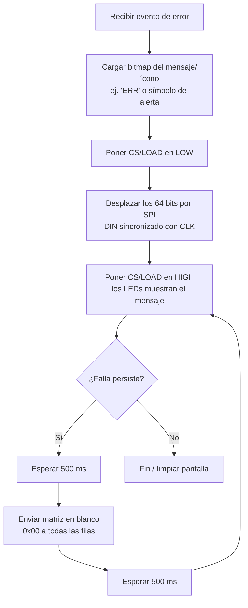

# Protocolo SPI para la Matriz de LEDs MAX7219

Documentación del protocolo de comunicación usado entre el microcontrolador y el módulo de matriz de LEDs MAX7219, empleado para mostrar los indicadores de falla del sistema.

## Índice

- [1. Introducción](#1-introducción)
- [2. ¿Qué es SPI?](#2-qué-es-spi)
- [3. Líneas de conexión](#3-líneas-de-conexión)
- [4. Transmisión bit a bit](#4-transmisión-bit-a-bit)
- [5. Estructura de los datos (16 bits por envío)](#5-estructura-de-los-datos-16-bits-por-envío)
- [6. Cascada de módulos](#6-cascada-de-módulos)
- [7. Secuencia de inicialización](#7-secuencia-de-inicialización)
- [8. Flujo: activar indicador de falla](#8-flujo-activar-indicador-de-falla)

---

## 1. Introducción

A diferencia del pulso único y estricto que usan las tiras WS2812B, el MAX7219 utiliza un protocolo síncrono basado en **SPI estándar**, lo que facilita bastante su programación en microcontroladores o FPGA.

SPI (*Serial Peripheral Interface*) es uno de los protocolos más usados en electrónica para conectar microcontroladores, FPGAs y pantallas. Es un protocolo **síncrono, en serie y maestro-esclavo**.

## 2. ¿Qué es SPI?

Para entenderlo de forma sencilla, imagínalo como una pista de atletismo con un silbato: cada "pitido" marca el momento exacto en que debe ocurrir una acción.

### ¿Qué significa que sea "síncrono"?

A diferencia de otras comunicaciones donde ambas partes deben "adivinar" la velocidad del otro, SPI usa una línea física dedicada llamada **Reloj (CLK)**.

- Cada vez que el maestro genera un pulso eléctrico en la línea de reloj, se lee **exactamente un bit** de información.
- Esto hace que la comunicación sea rápida y estable, sin depender de temporizaciones ultra estrictas en microsegundos como ocurre con el WS2812B.

## 3. Líneas de conexión

El módulo MAX7219 usa 3 líneas de control principal:

| Línea | Nombre completo | Función |
|---|---|---|
| **CLK** | Clock (Reloj) | Dicta el ritmo de la transmisión. El maestro marca los impulsos `0 → 1 → 0`. |
| **DIN / MOSI** | Data In / Master Output Slave Input | Cable de datos por donde viaja la información desde el controlador hacia la pantalla. |
| **CS / SS / LOAD** | Chip Select / Slave Select | Línea de "atención": en `LOW` indica que se está enviando información; al pasar a `HIGH` le dice al chip que muestre los datos recibidos. |

> **Nota:** en SPI estándar completo existe un cuarto cable, **MISO**, usado para que el esclavo responda datos al maestro. Como la matriz de LEDs solo recibe órdenes y nunca responde, esa línea no se utiliza.

**Resumen del comportamiento de CS/LOAD:**
- **LOW** → habilita la transmisión; mientras está en este estado, los bits se envían en cada flanco de reloj.
- **HIGH** → hace *latch* (carga/fija) y muestra los datos recibidos en los LEDs.

## 4. Transmisión bit a bit

Ejemplo: encender una fila de LEDs enviando el dato `10100000₂` (`0xA0` en hexadecimal).

1. **Selección:** el microcontrolador baja la línea `CS` a `0`.
2. **Envío del bit 1:**
   - Pone `DIN` en `1` (5V).
   - Genera un pulso en `CLK` (`0 → 1`). El MAX7219 lee un `1`.
3. **Envío del bit 2:**
   - Pone `DIN` en `0` (0V).
   - Genera un pulso en `CLK` (`0 → 1`). El chip lee un `0`.
4. Se repite el proceso hasta enviar los **16 bits** necesarios (8 bits de dirección + 8 bits de datos).
5. **Carga:** sube la línea `CS` a `1`. En ese instante la matriz actualiza sus LEDs.

## 5. Estructura de los datos (16 bits por envío)

Cada comando para un controlador MAX7219 se compone de un paquete de **16 bits (2 bytes)**:

```
[ 8 bits de Dirección / Registro ]  +  [ 8 bits de Datos / Píxeles ]
```

- **Dirección (bits 15-8):** selecciona qué fila de la matriz (1 a 8) o qué registro de configuración (intensidad, prueba, on/off) se va a modificar.
- **Datos (bits 7-0):** representa qué LEDs de esa fila se encienden (`1`) o se apagan (`0`).

## 6. Cascada de módulos

Como la placa tiene **4 matrices en serie**, la línea de datos atraviesa del primer módulo al cuarto. Para actualizar una fila completa de la pantalla, el controlador envía:

```
4 módulos × 16 bits = 64 bits seguidos
```

...antes de subir la señal `CS / LOAD` a `HIGH`.

## 7. Secuencia de inicialización

Antes de enviar cualquier imagen o texto de falla, el chip debe inicializarse mediante los siguientes comandos SPI:

| Registro | Dirección | Valor a enviar | Función |
|---|---|---|---|
| Shutdown | `0x0C` | `0x01` | Pasa de modo reposo a modo normal. |
| Decode Mode | `0x09` | `0x00` | Desactiva la decodificación BCD para trabajar en modo matriz directa de puntos. |
| Scan Limit | `0x0B` | `0x07` | Configura el chip para barrer las 8 filas. |
| Intensity | `0x0A` | `0x00` – `0x0F` | Ajusta el brillo deseado. |
| Display Test | `0x0F` | `0x00` | Desactiva el modo de prueba. |

## 8. Flujo: activar indicador de falla

Proceso para mostrar un indicador de falla en la pantalla (por ejemplo, ante un error de lectura de EEPROM):



**Pasos detallados:**

1. **Recibir evento de error:** identificar la fuente de la falla (ej.: error al leer EEPROM).
2. **Cargar mapa de píxeles (bitmap):** consultar en memoria la matriz de puntos del mensaje o ícono a mostrar.
3. **Poner CS/LOAD en LOW:** habilitar el canal de comunicación.
4. **Desplazar los 64 bits por SPI:** enviar los bytes de dirección y datos para las filas a través de `DIN`, sincronizado con `CLK`.
5. **Poner CS/LOAD en HIGH:** los LEDs muestran el mensaje enviado.
6. **Bucle de parpadeo:** esperar 500 ms, enviar una matriz en blanco (`0x00` a todas las filas), esperar 500 ms y volver a mostrar la falla mientras la condición persista.
